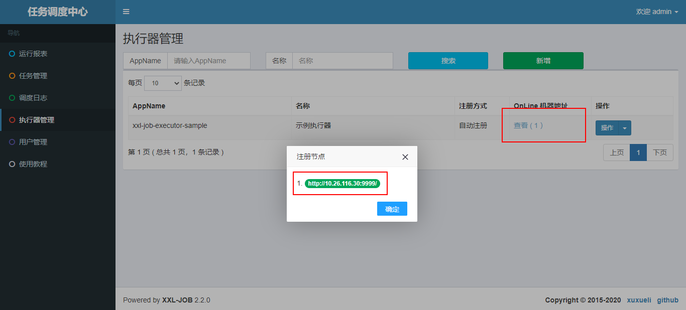
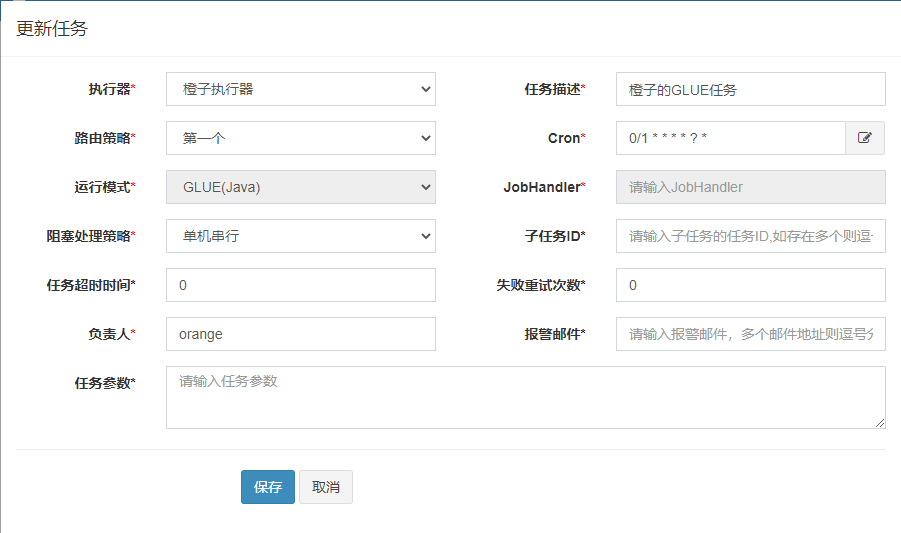
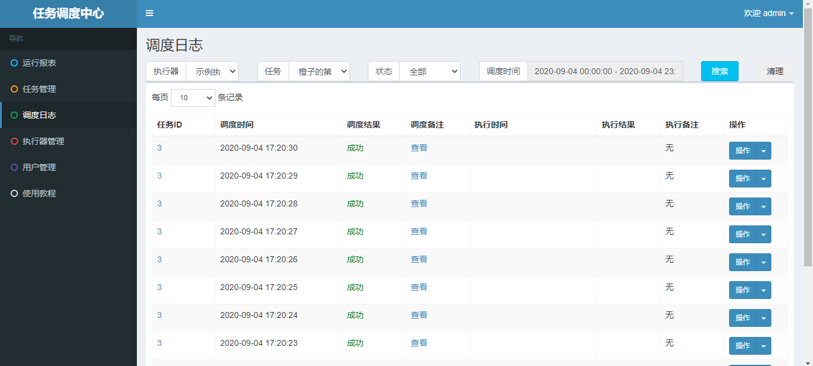

# 快速入门

其实官网教程比较清楚了，为了自己梳理整理下

[中文文档](http://www.xuxueli.com/xxl-job/#/)

[英文文档](http://www.xuxueli.com/xxl-job/en/#/)

## 1.下载项目源码并解压

[Github下载](https://github.com/xuxueli/xxl-job/releases)

[码云下载](https://gitee.com/xuxueli0323/xxl-job})

## 2.初始化调度数据库

执行调度数据库初始化SQL脚本（位置`/xxl-job/doc/db/tables_xxl_job.sql`）


执行后将生成一个`xxl_job`库，库中有八张表（有些博客说时16张，好像是新版没那么多，看最终生成的表数可以自己看SQL文件中的CreateTable语句有几条）

八张表的功能

- xxl_job_lock：任务调度锁表
- xxl_job_group：执行器信息表，维护任务执行器信息
- xxl_job_info：调度扩展信息表： 用于保存XXL-JOB调度任务的扩展信息，如任务分组、任务名、机器地址、执行器、执行入参和报警邮件等等
- xxl_job_log：调度日志表： 用于保存XXL-JOB任务调度的历史信息，如调度结果、执行结果、调度入参、调度机器和执行器等等
- xxl_job_log_report：调度日志报表：用户存储XXL-JOB任务调度日志的报表，调度中心报表功能页面会用到
- xxl_job_logglue：任务GLUE日志：用于保存GLUE更新历史，用于支持GLUE的版本回溯功能
- xxl_job_registry：执行器注册表，维护在线的执行器和调度中心机器地址信息
- xxl_job_user：系统用户表

## 3.编译源码

按照maven格式将源码导入IDE, 使用maven进行编译

解码后可看到整个项目结构如下

- xxl-job-admin：调度中心

- xxl-job-core：公共依赖

- xxl-job-executor-samples：执行器Sample示例（选择合适的版本执行器，可直接使用，也可以参考其并将现有项目改造成执行器）

  - xxl-job-executor-sample-springboot：Springboot版本，通过Springboot管理执行器，推荐这种方式

  - xxl-job-executor-sample-spring：Spring版本，通过Spring容器管理执行器，比较通用

  - xxl-job-executor-sample-frameless：无框架版本

  - xxl-job-executor-sample-jfinal：JFinal版本，通过JFinal管理执行器

  - xxl-job-executor-sample-nutz：Nutz版本，通过Nutz管理执行器

  - xxl-job-executor-sample-jboot：jboot版本，通过jboot管理执行器；


## 4.配置部署调度中心

调度中心在源码中的项目名：xxl-job-admin

作用：统一管理任务调度平台上调度任务，负责触发调度执行，并且提供任务管理平台。

### 调度中心配置

修改调度中心配置文件(`/xxl-job/xxl-job-admin/src/main/resources/application.properties`)内容：

```properties
### 调度中心JDBC链接：链接地址请保持和 2.1章节 所创建的调度数据库的地址一致spring.datasource.url=jdbc:mysql://127.0.0.1:3306/xxl_job?useUnicode=true&characterEncoding=UTF-8&autoReconnect=true&serverTimezone=Asia/Shanghai
spring.datasource.username=root
spring.datasource.password=root_pwd
spring.datasource.driver-class-name=com.mysql.jdbc.Driver

### 报警邮箱
spring.mail.host=smtp.qq.com
spring.mail.port=25
spring.mail.username=xxx@qq.com
spring.mail.password=xxx
spring.mail.properties.mail.smtp.auth=true
spring.mail.properties.mail.smtp.starttls.enable=true
spring.mail.properties.mail.smtp.starttls.required=true
spring.mail.properties.mail.smtp.socketFactory.class=javax.net.ssl.SSLSocketFactory

### 调度中心通讯TOKEN [选填]：非空时启用；
xxl.job.accessToken=
### 调度中心国际化配置 [必填]:默认为"zh_CN"/中文简体, 可选"zh_CN"/中文简体,"zh_TC"/中文繁体and"en"/英文；
xxl.job.i18n=zh_CN
## 调度线程池最大线程配置【必填】
xxl.job.triggerpool.fast.max=200
xxl.job.triggerpool.slow.max=100
### 调度中心日志表数据保存天数 [必填]：过期日志自动清理；限制大于等于7时生效，否则, 如-1，关闭自动清理功能；
xxl.job.logretentiondays=30
```


### 部署项目

该工程是一个springboot项目，配置后执行 `XxlJobAdminApplication `类即可运行该工程

调度中心访问地址：http://localhost:8080/xxl-job-admin  默认登录账号 “admin/123456”, 登录后运行界面如下图所示。


出现该页面表示调度中心已经部署成功

## 5.配置部署执行器

作者提供了各种执行器的例子在`/xxl-job/xxl-job-executor-samples/`中，下面是以`xxl-job-executor-samples-spring`为模板自己写执行器的过程。也可以直接运行提供的执行器。注意此处用的是2.2.0版本，移除了旧类注解`@JobHandler`，使用基于方法注解 `@XxlJob` 的方式进行任务开发。即之前用`@JobHandler`标注类，现在用`@XxlJob`标注方法，两个功能一致。

### maven依赖

确认pom文件中引入了 `xxl-job-core` 的maven依赖；

```xml
<?xml version="1.0" encoding="UTF-8"?>
<project xmlns="http://maven.apache.org/POM/4.0.0" xmlns:xsi="http://www.w3.org/2001/XMLSchema-instance"
	xsi:schemaLocation="http://maven.apache.org/POM/4.0.0 https://maven.apache.org/xsd/maven-4.0.0.xsd">
	<modelVersion>4.0.0</modelVersion>
	<!--父级依赖-->
	<parent>
		<groupId>org.springframework.boot</groupId>
		<artifactId>spring-boot-starter-parent</artifactId>
		<version>2.1.0.RELEASE</version>
		<relativePath/> <!-- lookup parent from repository -->
	</parent>
	<groupId>com.orange</groupId>
	<artifactId>orange</artifactId>
	<version>0.0.1-SNAPSHOT</version>
	<name>orange</name>
	<description>orange learn java</description>

	<properties>
		<java.version>1.8</java.version>
	</properties>

	<dependencies>
		<dependency>
			<groupId>org.springframework.boot</groupId>
			<artifactId>spring-boot-starter-web</artifactId>
		</dependency>
		<dependency>
			<groupId>org.springframework.boot</groupId>
			<artifactId>spring-boot-starter-test</artifactId>
			<scope>test</scope>
		</dependency>

		<!-- MySql -->
		<dependency>
			<groupId>mysql</groupId>
			<artifactId>mysql-connector-java</artifactId>
			<scope>runtime</scope>
		</dependency>

		<!-- xxl-rpc-core -->
		<dependency>
			<groupId>com.xuxueli</groupId>
			<artifactId>xxl-job-core</artifactId>
			<version>2.2.0</version>   <!--注意版本要和调度中心使用的xxl版本一致-->
		</dependency>

	</dependencies>

	<build>
		<plugins>
			<plugin>
				<groupId>org.springframework.boot</groupId>
				<artifactId>spring-boot-maven-plugin</artifactId>
				<version>2.2.6.RELEASE</version>
			</plugin>
		</plugins>
	</build>

</project>
```

### 执行器配置

作者提供的示例执行器配置文件地址：

`xxl-job-executor-samples/xxl-job-executor-sample-springboot/src/main/resources/application.properties`

执行器配置，配置内容说明：

```properties
server:
  port: 8082    # 一定要配置，不然会默认连接8080与调度中心端口号冲突
spring:
  application:
    name: demo
  profiles:
    active: dev
  # Mysql数据库配置
  datasource:
    url: jdbc:mysql://127.0.0.1:3306/orange_learning?useUnicode=true&characterEncoding=UTF8&useSSL=false
    username: root
    password: .a123456

# xxl配置
xxl:
  job:
    accessToken:
    admin:
      #调度中心部署跟地址：如调度中心集群部署存在多个地址则用逗号分隔。
      #执行器将会使用该地址进行"执行器心跳注册"和"任务结果回调"。
      addresses: http://127.0.0.1:8080/xxl-job-admin

    #分别配置执行器的名称、ip地址、端口号
    #注意：如果配置多个执行器时，防止端口冲突
    executor:
      appname: orangeDemo
      ip:
      address:
      port: 9998
      #执行器运行日志文件存储的磁盘位置，需要对该路径拥有读写权限
      logpath: /data/applogs/xxl-job/jobhandler
      #执行器Log文件定期清理功能，指定日志保存天数，日志文件过期自动删除。限制至少保持3天，否则功能不生效；
      logretentiondays: 30
```

### 执行器组件配置

执行器组件，配置文件地址：

`xxl-job-executor-sample-springboot/src/main/java/com/xxl/job/executor/core/config/XxlJobConfig.java`

```java
@Configuration
public class XxlJobConfig {
    private Logger logger = LoggerFactory.getLogger(XxlJobConfig.class);

    @Value("${xxl.job.admin.addresses}")
    private String adminAddresses;

    @Value("${xxl.job.accessToken}")
    private String accessToken;

    @Value("${xxl.job.executor.appname}")
    private String appname;

    @Value("${xxl.job.executor.address}")
    private String address;

    @Value("${xxl.job.executor.ip}")
    private String ip;

    @Value("${xxl.job.executor.port}")
    private int port;

    @Value("${xxl.job.executor.logpath}")
    private String logPath;

    @Value("${xxl.job.executor.logretentiondays}")
    private int logRetentionDays;


    @Bean
    public XxlJobSpringExecutor xxlJobExecutor() {
        logger.info(">>>>>>>>>>> xxl-job config init.");
        XxlJobSpringExecutor xxlJobSpringExecutor = new XxlJobSpringExecutor();
        xxlJobSpringExecutor.setAdminAddresses(adminAddresses);
        xxlJobSpringExecutor.setAppname(appname);
        xxlJobSpringExecutor.setAddress(address);
        xxlJobSpringExecutor.setIp(ip);
        xxlJobSpringExecutor.setPort(port);
        xxlJobSpringExecutor.setAccessToken(accessToken);
        xxlJobSpringExecutor.setLogPath(logPath);
        xxlJobSpringExecutor.setLogRetentionDays(logRetentionDays);

        return xxlJobSpringExecutor;
    }
}
```

### 添加执行器

进入调度中心，选择执行器管理->新增来新增一个执行器信息。作者提供的范例默认添加了，无需这个步骤（可以看到执行器列表里面有xxl-job-executor-sample执行器，就是默认的范例）


[执行器属性详情](#执行器属性详情)

### 部署执行器项目

配置后执行`XxlJobExecutorApplication`类/自己写的类

执行器运行后会向调度中心注册，在调度中心的UI上的执行器管理界面可以查看到机器地址，没有注册时是无



## 6.开发一个Bean模式任务

本示例以新建一个 `Bean模式`运行模式的任务为例。

### 新建任务代码

```java
@Component
public class HelloHandler {

    @XxlJob("orangeHandler")   // 旧版用的JobHandler
    public ReturnT<String> demoJobHandler(String param) throws Exception {
        XxlJobLogger.log("Orange, Hello World.");
        return ReturnT.SUCCESS;
    }
}
```
旧版的写法

```java
@JobHandler(value = "orangeHandler")
@Component
public class DemoJobHandler extends IJobHandler {   // 要统一继承IJobHandler并重写execute方法

    @Override
    public ReturnT<String> execute(String param) throws Exception {
        XxlJobLogger.log("Orange, Hello World.");
        return ReturnT.SUCCESS;
    }
}
```

### 调度中心新建任务

登录调度中心，点击下图所示“新建任务”按钮，新建示例任务。然后，参考下面截图中任务的参数配置，点击保存。


[任务属性详情](#任务属性详情)

## 6.开发一个GLUE模式任务

### 调度中心新建任务

可以看到不需要JobHandler，因为GLUE模式(Java)运行模式的任务实际上是一段继承自IJobHandler的Java类代码，它在执行器项目中运行，代码由调度中心维护



### 编辑任务代码

新增任务后，点击操作->GLUE IDE编辑具体任务代码

```java
package com.xxl.job.service.handler;

import com.xxl.job.core.log.XxlJobLogger;
import com.xxl.job.core.biz.model.ReturnT;
import com.xxl.job.core.handler.IJobHandler;

// 继承IJboHandelr
public class DemoGlueJobHandler extends IJobHandler {

	@Override
	public ReturnT<String> execute(String param) throws Exception {
		XxlJobLogger.log("Orange, Hello World.");
		return ReturnT.SUCCESS;
	}

}
```

## 7.执行并查看结果

### 触发执行

点击任务右侧 操作->执行一次  按钮，可手动触发一次任务执行（通常情况下，点击启动后，通过配置Cron表达式进行任务调度触发）

### 查看日志

请点击任务右侧 操作->查询日志 按钮，可前往任务日志界面查看任务日志

在任务日志界面中，可查看该任务的历史调度记录以及每一次调度的任务调度信息、执行参数和执行信息。

运行中的任务点击右侧的 执行日志 按钮，可进入日志控制台查看实时执行日志。



在日志控制台，可以Rolling方式实时查看任务在执行器一侧运行输出的日志信息，实时监控任务进度

最终可看到运行结果如下


# <span id="任务属性详情">任务配置属性</span>


- 执行器：任务的绑定的执行器，任务触发调度时将会自动发现注册成功的执行器, 实现任务自动发现功能; 另一方面也可以方便的进行任务分组。每个任务必须绑定一个执行器, 可在 "执行器管理" 进行设置;
- JobHandler：运行模式为 "BEAN模式" 时生效，对应执行器中新开发的JobHandler类“@JobHandler”注解自定义的value值；
- 子任务：每个任务都拥有一个唯一的任务ID(任务ID可以从任务列表获取)，当本任务执行结束并且执行成功时，将会触发子任务ID所对应的任务的一次主动调度。
- 任务超时时间：支持自定义任务超时时间，任务运行超时将会主动中断任务；
- 失败重试次数；支持自定义任务失败重试次数，当任务失败时将会按照预设的失败重试次数主动进行重试；
- 报警邮件：任务调度失败时邮件通知的邮箱地址，支持配置多邮箱地址，配置多个邮箱地址时用逗号分隔；
- 执行参数：任务执行所需的参数；

## Cron表达式

Cron表达式是一个字符串，字符串以空格隔开，分为6或7个域，每一个域代表一个含义

Corn从左到右的域（用空格隔开）分别表示：秒 分 小时 日期 月份 星期 [年份(可选)]

各域的含义

| 域                       | 允许值                                 | 允许的特殊字符             |
| ------------------------ | -------------------------------------- | -------------------------- |
| 秒（Seconds）            | 0~59的整数                             | , - * /   四个字符         |
| 分（*Minutes*）          | 0~59的整数                             | , - * /   四个字符         |
| 小时（*Hours*）          | 0~23的整数                             | , - * /   四个字符         |
| 日期（*DayofMonth*）     | 1~31的整数（但是你需要考虑你月的天数） | ,- * ? / L W C   八个字符  |
| 月份（*Month*）          | 1~12的整数或者 JAN-DEC                 | , - * /   四个字符         |
| 星期（*DayofWeek*）      | 1~7的整数或者 SUN-SAT （1=SUN）        | , - * ? / L C #   八个字符 |
| 年(可选，留空)（*Year*） | 1970~2099                              | , - * /   四个字符         |

特殊字符

| 符   | 详情                                                         |                                                              |
| ---- | ------------------------------------------------------------ | ------------------------------------------------------------ |
| \*   | 任意值                                                       | Minutes=*,，意味着每分钟都会触发事件                         |
| ?    | 任意值                                                       | DayofMonth=20 DayofWeek=?，意味着在每月的20日触发调度，不管20日到底是星期几 |
| -    | 表范围                                                       | Minutes=5-20，意味着从5分到20分钟每分钟触发一次              |
| /    | 表起始时间开始触发，每隔固定时间触发一次                     | Minutes=5/20，意味着5分开始触发，每隔20分钟触发一次          |
| ,    | 列出枚举值，枚举值用`,`隔开                                  | Minutes=5,20，意味着在5和20分每分钟触发一次                  |
| L    | 表最后                                                       | DayofWeek=5L，意味着在最后的一个星期四触发                   |
| W    | 表有效工作日，系统将在离指定日期的最近的有效工作日触发事件，注意：W的最近寻找不会跨过月份 | DayofMonth=5W，意味着如果5日是星期六，则将在最近的工作日：星期五，即4日触发。如果5日是星期天，则在6日(周一)触发 |
| LW   | 表示在某月最后一个工作日，即最后一个星期五                   |                                                              |
| #    | 每个月第几个星期几                                           | DayofMonth=4#2，意味着某月的第二个星期三                     |

## 路由策略

当执行器集群部署时，提供丰富的路由策略：

- FIRST（第一个）：固定选择第一个机器

- LAST（最后一个）：固定选择最后一个机器；
- ROUND（轮询）：顺序循环的选择机器；
- RANDOM（随机）：随机选择在线的机器；
- CONSISTENT_HASH（一致性HASH）：每个任务按照Hash算法固定选择某一台机器，且所有任务均匀散列在不同机器上。
- LEAST_FREQUENTLY_USED（最不经常使用）：使用频率最低的机器优先被选举；
- LEAST_RECENTLY_USED（最近最久未使用）：最久未使用的机器优先被选举；
- FAILOVER（故障转移）：按照顺序依次进行心跳检测，第一个心跳检测成功的机器选定为目标执行器并发起调度；
- BUSYOVER（忙碌转移）：按照顺序依次进行空闲检测，第一个空闲检测成功的机器选定为目标执行器并发起调度；
- SHARDING_BROADCAST(分片广播)：广播触发对应集群中所有机器执行一次任务，同时系统自动传递分片参数；可根据分片参数开发分片任务；

## 阻塞处理策略

调度过于密集执行器来不及处理时的处理策略

- 单机串行（默认）：调度请求进入单机执行器后，调度请求进入FIFO队列并以串行方式运行；

- 丢弃后续调度：调度请求进入单机执行器后，发现执行器存在运行的调度任务，本次请求将会被丢弃并标记为失败；
- 覆盖之前调度：调度请求进入单机执行器后，发现执行器存在运行的调度任务，将会终止运行中的调度任务并清空队列，然后运行本地调度任务；

## 运行模式

- **BEAN模式**：任务以JobHandler方式维护在执行器端；需要结合 `@JobHandler / @XxlJob`"属性匹配执行器中任务；
- **GLUE模式(Java)**：任务以源码方式维护在调度中心；该模式的任务实际上是一段继承自`IJobHandler`的Java类代码并 `groovy`源码方式维护，它在执行器项目中运行，可使用`@Resource / @Autowire`注入执行器里中的其他服务；
- **GLUE模式(Shell)**：任务以源码方式维护在调度中心；该模式的任务实际上是一段 "shell" 脚本；
- **GLUE模式(Python)**：任务以源码方式维护在调度中心；该模式的任务实际上是一段 "python" 脚本；
- **GLUE模式(PHP)**：任务以源码方式维护在调度中心；该模式的任务实际上是一段 "php" 脚本；
- **GLUE模式(NodeJS)**：任务以源码方式维护在调度中心；该模式的任务实际上是一段 "nodejs" 脚本；
- **GLUE模式(PowerShell)**：任务以源码方式维护在调度中心；该模式的任务实际上是一段 "PowerShell" 脚本；

# <span id="执行器属性详情">执行器配置属性</span>


- AppName: 是每个执行器集群的唯一标示AppName, 执行器会周期性以AppName为对象进行自动注册。可通过该配置自动发现注册成功的执行器, 供任务调度时使用
- 名称: 执行器的名称, 因为AppName限制字母数字等组成,可读性不强, 名称为了提高执行器的可读性
- 排序: 执行器的排序, 系统中需要执行器的地方,如任务新增, 将会按照该排序读取可用的执行器列表
- 注册方式：调度中心获取执行器地址的方式
- 自动注册：执行器自动进行执行器注册，调度中心通过底层注册表可以动态发现执行器机器地址
- 手动录入：人工手动录入执行器的地址信息，多地址逗号分隔，供调度中心使用
- 机器地址："注册方式"为"手动录入"时有效，支持人工维护执行器的地址信息

# 一些错误的解决

## xxl-job registry error


报错xxl-job registry error底下是302时，检查调度中心的xxl-job版本和执行器的一不一样


参考：

https://www.cnblogs.com/daxiangfei/p/10219706.html

https://www.xuxueli.com/xxl-job/

https://www.jianshu.com/p/fa7186bea84b