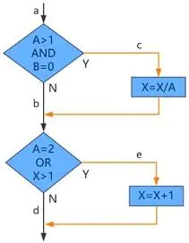

# 单元测试的任务

单元测试只针对功能点进行测试，不包括对业务流程正确性的测试

1. 接口功能性测试：保证接口能够被正常使用，并输出有效数据

   - 是否被顺利调用

   - 参数是否符合预期

2. 局部数据结构测试：保证数据结构的正确性

   - 变量是否有初始值或在某场景下是否有默认值

   - 变量是否溢出

3. 边界条件测试：测试

   - 变量无赋值(null)
   - 变量是数值或字符
   - 主要边界：最大值，最小值，无穷大
   - 溢出边界：在边界外面取值+/-1
   - 临近边界：在边界值之内取值+/-1
   - 字符串的边界，引用 "变量字符"的边界
   - 字符串的设置，空字符串
   - 字符串的应用长度测试
   - 空白集合
   - 目标集合的类型和应用边界
   - 集合的次序
   - 变量是规律的，测试无穷大的极限，无穷小的极限

4. 代码覆盖测试：保证每一句代码，所有分支都测试完成，主要包括代码覆盖率，异常处理通路测试

   - 语句覆盖率：每个语句都执行到了
   - 判定覆盖率：每个分支都执行到了
   - 条件覆盖率：每个条件都返回布尔
   - 路径覆盖率：每个路径都覆盖到了
   
5. 异常模块测试：保证每一个异常都经过测试，后续处理模块测试：是否包闭当前异常或者对异常形成消化,是否影响结果!

# 单元测试的数据准备

正常数据-数据量最大，最关键，正案例反案例都属于正常数据

边界数据-介于正常数据和异常数据之间的一种数据

异常数据-设计输入参数是测试案例进入异常分支，校验程序处理异常的能力

# 代码覆盖测试用例设计方法

## 代码覆盖定义 

以下段测试代码为例：

```java
public void foo (int a, int b, int x) {
    if(a>1 && b ==0) {
        x = x/a;
    }

    if (a==2 || x>1) {
        x = x+1;
    }
}
```




|          | 语句覆盖                         | 判定覆盖                                               | 条件覆盖                                   | 判定/条件覆盖                                                | 组合覆盖                                                     | 路径覆盖                                                     |
| -------- | -------------------------------- | ------------------------------------------------------ | ------------------------------------------ | ------------------------------------------------------------ | ------------------------------------------------------------ | ------------------------------------------------------------ |
| 覆盖范围 | 每条**语句**至少被执行一次       | 每个**判定**真假至少出现一次                           | 每个**条件**真假至少出现一次               | 每个**条件**真假至少出现一次，且每个**判定**本身真假也至少出现一次 | 每个**条件的所有可能组合**至少出现一次                       | 所有可能的**路径**至少出现一次（可画出流程图方便设计）       |
| 缺点     | 最弱的覆盖，难以发现程序中的错误 | 当判定由多个条件组合构成时，它未必能发现每个条件的错误 | 条件覆盖并不一定总能覆盖全部分支           | 条件覆盖和判定/条件覆盖不一定会发现逻辑表达式中的错误        | 组合覆盖不一定能覆盖到每条路径                               | 路径覆盖不一定把所有的条件组合情况都覆盖，复杂程序的用例数呈指数级上升，路径覆盖无法发现程序不符合设计规范的错误 |
| 例子     | a=2 b=0 x=1*`ace`*               | a=2 b=0 x=1*`ace`*<br />a=1 b=0 x=1*`abd`*             | a=1 b=0 x=3*`abe`*<br />a=2 b=1 x=1*`abe`* | a=2，b=0，x=4*`ace`* <br/>a=1，b=1，x=1*`abd`*               | a=2，b=0，x=4 *`ace`*<br/>a=2，b=1，x=1*`abe`*<br/>a=1，b=0，x=2 *`abe`*<br/>a=1，b=1，x=1*`abd`* | a=1，b=0，x=1 *`abd`*<br/>a=1，b=0，x=2 *`abe`*<br/>a=3，b=0，x=1 *`acd`*<br/>a=2，b=0，x=3 *`ace`* |

## 根据场景选择测试方式：


逻辑简单、分支较少、代码架子比较小的代码使用语句覆盖（50%）

业务价值比较高、逻辑代码比较复杂的使用判定覆盖条件覆盖甚至判定条件覆盖（30%）

最核心底层算法、框架类的代码使用组合覆盖、路径覆盖（20%）

# JUNIT测试框架

## 常用注解

| 注释名       | 放置位置               | 功能                                                         |
| ------------ | ---------------------- | ------------------------------------------------------------ |
| @Test        | 方法                   | 标记测试方法，在这里可以测试期望异常和超时时间               |
| @Ignore      | 方法                   | 标记忽略的测试方法                                           |
| @BeforeClass | public static void方法 | 运行测试类中的所有用例前都会运行该方法，可在该方法中做一些前置操作，如创建数据库连接，初始化数据等 |
| @AfterClass  | public static void方法 | 和@BeforeClass注解对应，在运行完测试类中的所有测试用例后执行，可在该方法中做一些后续工作，如回复数据库，断开数据库连接等 |
| @Before      | public void方法        | 会在每个用例运行之前都运行一次该方法。主要用于一些独立与用例之间的准备工作 |
| @After       | public void方法        | 与@Before注解对应，会在每个用例运行之后运行一次              |
| @Runwith     | 类                     | 用来确定这个类如何运行，也可以不标注，会使用默认运行器       |
| @Parameters  | 类                     | 用于参数化测试                                               |

一个JUNIT的单元测试用例执行顺序

@BeforeClass -> @Before -> @Test -> @After -> @AfterClass

每个测试方法的调用顺序

@Before -> @Test -> @After

## JUNIT的使用

### 依赖添加

```xml
<dependency>         
	<groupId>junit</groupId>         
	<artifactId>junit</artifactId>         
	<version>4.10</version>         
	<scope>test</scope>     
</dependency>
```

### @Test

@Test(expected = Exception.class) 预期会抛出Exception.class异常

@Test(timeout=100)预期方法执行不会超过100毫秒，控制死循环


### @Runwith 

@RunWith(Parameterized.class) 使用参数化测试方式运行

@RunWith(SpringRunner.class)   使用Spring测试方式运行


### @Parameters

@Parameterized.Parameters 申明当前方法为测试数据来源


### 完整代码

#### 被测试类

```java
public class HelloJunit {
    private final int MAX_FACT = 50;
    public long fact(long n) {
        if (n<0){
            throw new RuntimeException("复数不能阶乘");
        }
        if (n>MAX_FACT) {
            throw new RuntimeException("暂不支持50以上的阶乘");
        }
        int r = 1;
        for (int i = 1; i <= n; i++) {
            r = r * i;
        }
        return r;
    }
}
```

#### 默认测试方式

```java
import org.junit.Before;
import org.junit.Test;
import static org.junit.Assert.*;
 
public class HelloJunitTest {
    private HelloJunit j;

    // 实例化被测试类
    @Before
    public void setUp() throws Exception {
        j = new HelloJunit();
    }

    // 正常功能测试
    @Test
    public void fact() {
        long n = 1L;
        long result = j.fact(n);
        assertEquals(expResult, result);
    }

    // 异常的测试
    @Test(expected = RuntimeException.class)
    public void factExceptionTest() {
            long n = -1L;
            long result = j.fact(n);
    }
}
```


#### 参数化测试方式

```java
import org.junit.Before;
import org.junit.Test;
import org.junit.runner.RunWith;
import org.junit.runners.Parameterized;

import java.util.Arrays;
import java.util.Collection;
import java.util.Collections;

import static org.junit.Assert.*;

@RunWith(Parameterized.class)   
public class HelloJunitTest {
    private HelloJunit j;
    private long n;
    private long expResult;

    // 使用参数化测试方式时，必须声明构造方法
    public HelloJunitTest(long n, long expResult) {
        this.n = n;
        this.expResult = expResult;
    }

    @Before
    public void setUp() throws Exception {
        j = new HelloJunit();
    }

    // 创建测试参数，创建的测试参数将通过类属性n和expResult传入测试方法
    @Parameterized.Parameters   
    public static Collection data(){
        return Arrays.asList(new Object[][]{{-1L,1L},{-3L,6L},{-5L,120L}});
    }

    // 正常功能测试
    @Test
    public void fact() {
        long result = j.fact(n);
        assertEquals(expResult, result);
    }

    // 异常的测试
    @Test(expected = RuntimeException.class)
    public void factExceptionTest() {
        long result = j.fact(n);
    }
}
```

#### 在spring框架下的测试方式

导入相关依赖

```xml
<dependency>         
    <groupId>org.springframework</groupId>         
    <artifactId>spring-test</artifactId>         
    <version>3.2.9.RELEASE</version>         
    <scope>test</scope>     
</dependency>
```

测试类

```java
import org.junit.Before;
import org.junit.Test;
import org.junit.runner.RunWith;
import org.junit.runners.Parameterized;

import java.util.Arrays;
import java.util.Collection;
import java.util.Collections;

import static org.junit.Assert.*;

// 使用spring框架的Test，会自动搜索相关依赖并实例。支持test环境下的配置文件，放在test中的resources中自动使用
@RunWith(SpringRunner.class)   
@SpringBootTest
public class HelloJunitTest {

    @Autowired  // 使用注入方式实例化
    private HelloJunit j;
    private long n;
    private long expResult;

    public HelloJunitTest(long n, long expResult) {
        this.n = n;
        this.expResult = expResult;
    }

    @Parameterized.Parameters
    public static Collection data(){
        return Arrays.asList(new Object[][]{{-1L,1L},{-3L,6L},{-5L,120L}});
    }

    // 正常功能测试
    @Test
    public void fact() {
        long result = j.fact(n);
        assertEquals(expResult, result);
    }

    // 异常的测试
    @Test(expected = RuntimeException.class)
    public void factExceptionTest() {
        long result = j.fact(n);
    }
}
```


## 常用断言

| 断言                                                         | 描述                                                         |
| ------------------------------------------------------------ | ------------------------------------------------------------ |
| void assertEquals\(\[String message\], expected value, actual value\) | 断言两个值相等。值可能是类型有 int, short, long, byte, char or java\.lang\.Object\. 第一个参数是一个可选的字符串消息 |
| void assertTrue\(\[String message\], boolean condition\)     | 断言一个条件为真                                             |
| void assertFalse\(\[String message\],boolean condition\)     | 断言一个条件为假                                             |
| void assertNotNull\(\[String message\], java\.lang\.Object object\) | 断言一个对象不为空\(null\)                                   |
| void assertNull\(\[String message\], java\.lang\.Object object\) | 断言一个对象为空\(null\)                                     |
| void assertSame\(\[String message\], java\.lang\.Object expected, java\.lang\.Object actual\) | 断言，两个对象引用相同的对象，类似==判断                     |
| void assertNotSame\(\[String message\], java\.lang\.Object unexpected, java\.lang\.Object actual\) | 断言，两个对象不是引用同一个对象，类似!=判断                 |
| void assertArrayEquals\(\[String message\], expectedArray, resultArray\) | 断言预期数组和结果数组相等。数组的类型可能是 int, long, short, char, byte or java\.lang\.Object\. |
| void assertThat(actual, matcher)                             | 查看实际值是否满足指定条件                                   |

# Mock

- mockito官网：http://site.mockito.org/#how
- mockito中文文档：http://blog.csdn.net/bboyfeiyu/article/details/52127551#2

在测试过程中，对于某些不容易构造或者不容易获取的对象，可使用mock来虚拟一个对象来创建以便测试的测试方法。

 

常见mock框架

EasyMock、Mockito、PowerMock、Jmockit

 

常见的mock场景：

对象 模拟一些再应用中不容易构造或比较复杂的对象

接口 调用别的接口中的方法必须mock，达到隔离的效果

静态方法 工具类中的静态方法建议mock，单独测试

Dao层方法 Dao层操作数据库的方法必须Mock，隔离数据库

私有方法 建议通过共有方法直接覆盖私有方法的方法来测试，也可以将司有关方法mock，之后用反射的方法单独测试

 

# Jacoco代码覆盖率检测工具

一个测试覆盖率的插件


 