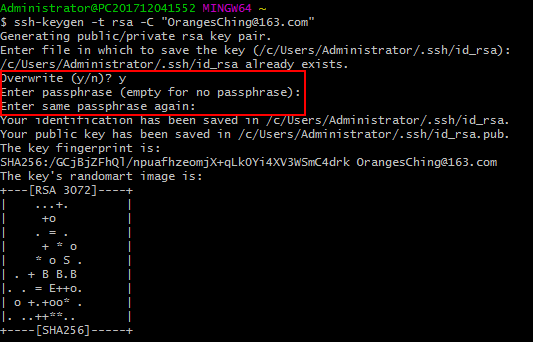
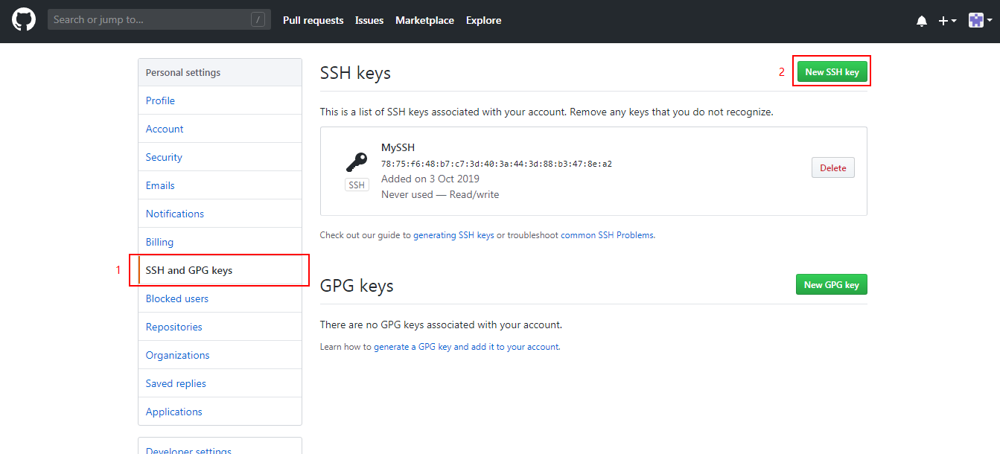
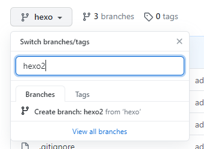
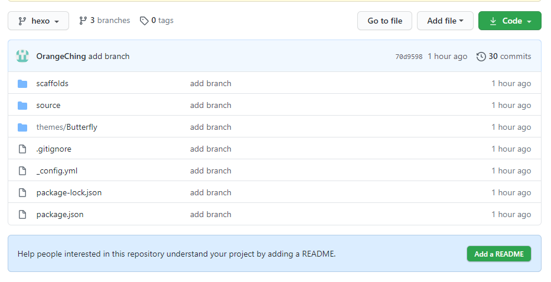
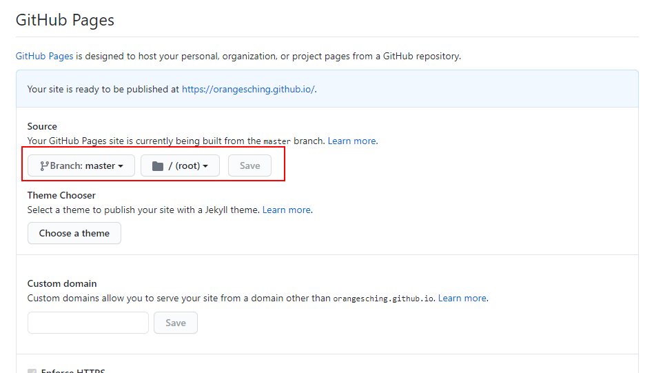

# 注册Github账号、创建代码库

1. 没有账号的先[注册](https://github.com/)账号


2. 点击 Start project 或者下面的 new repository 创建一个新的仓库，注意仓库名要以  **用户名.github.io** 命名。且Github规定一个用户仅能使用一个同名仓库的代码托管一个静态站点

   

3. 可访问 https://用户名.github.io 来访问你的静态站点（如果你在该仓库写一个index.html则会显示这个页面的内容）

# <span id="2">安装各种工具</span>

## Git

1. 下载[Git](https://git-scm.com/downloads)，[Git使用教程](https://www.liaoxuefeng.com/wiki/896043488029600)

2. 傻瓜式安装，成功标志：在开始菜单里找到“Git”->“Git Bash”，，蹦出一个类似命令行窗口的东西

3. 配置Git，没有账号的见注册步骤

   ```shell
   git config --global user.name "Your Name"
   git config --global user.email "email@example.com"
   ```

## NodeJS

Node.js 是一个基于 Chrome V8 引擎的 [JavaScript](https://baike.baidu.com/item/JavaScript/321142) 运行环境。 Node.js 使用了一个事件驱动、非阻塞式 I/O 的模型。Node 是一个让 JavaScript 运行在[服务端](https://baike.baidu.com/item/服务端/6492316)的开发平台，它让 JavaScript 成为与[PHP](https://baike.baidu.com/item/PHP/9337)、[Python](https://baike.baidu.com/item/Python/407313)、[Perl](https://baike.baidu.com/item/Perl/851577)、[Ruby](https://baike.baidu.com/item/Ruby/11419) 等服务端语言平起平坐的[脚本语言](https://baike.baidu.com/item/脚本语言/1379708)。

npm是NodeJS的包管理器

由于Hexo基于NodeJS，安装Hexo需先安装NodeJS

1. 下载[NodeJS](https://nodejs.org/en/)

2. 傻瓜式安装，成功标志：打开cmd输入node -v和npm -v显示版本。显示不是内部或外部命令的解决方法

   - 重启cmd
   - 查看是否配置NodeJS环境变量(计算机->属性->高级系统属性->高级->环境变量->找到Path查看是否有NodeJS路径)

3. 验证前两步

   打开git bash（Windowns）或者终端（Mac），在命令行中输入相应命令验证是否成功，如果成功会有相应的版本号

   ```shell
   git version
   node -v
   npm -v
   ```

## Hexo

以上环境准备好了就可以使用 npm 开始安装 Hexo 了，[官方Hexo文档](https://hexo.io/zh-cn/)

使用NodeJS的包管理器npm来安装Hexo，在命令行输入：

```shell
npm install -g hexo-cli
```

# 使用Hexo生成本地博客

## 使用以下命令初始化一个博客项目

```shell
cd <博客放置的路径>  #不执行此语句默认在用户目录下
hexo init <博客文件夹名>
cd s<博客文件夹名>
npm install
```

创建完成后，博客文件夹目录如下：

```shell
.
├── _config.yml # 网站的配置信息，您可以在此配置大部分的参数。 
├── package.json
├── scaffolds # 模版文件夹,当您新建文章时，Hexo 会根据 scaffolds 来建立文件
├── source  # 资源文件夹，除 _posts 文件，其他以下划线_开头的文件或者文件夹不会被编译打包到public文件夹
|   └── _posts # 文章Markdowm文件 
└── themes  # 主题文件夹，Hexo 会根据主题来生成静态页面
```

## 运行浏览博客

要能够在本地预览自己的博客，需要本地启动服务器

```shell
hexo s   #浏览器访问 http://localhost:4000 浏览
```

本地博客搭建成功，下面部署到 Github Page

# 部署到Github Page

## 配置SSH key

要使用 git 工具首先要配置一下SSH key，为部署本地博客到 Github 做准备。

1. 查看是否有SSH key

   打开命令行输入 cd ~/.ssh 如果没报错或者提示什么的说明就是以前生成过的，直接使用 cat ~/.ssh/id_rsa.pub 命令就是可以查看本机上的 SSH key 了。

   ```
   cat ~/.ssh/id_rsa.pub
   ```

2. 没有就创建

   全局配置一下本地账户：

   ```
   git config --global user.name "用户名"
   git config --global user.email "邮箱地址"
   ```

   生成密钥 SSH key

   ```
   ssh-keygen -t rsa -C '上面的邮箱'
   ```

   按照提示完成三次回车，即可生成 ssh key。通过查看 ~/.ssh/id_rsa.pub 文件内容，获取到你的 SSH key

   

   首次使用还需要确认并添加主机到本机SSH可信列表。若返回 Hi xxx! You've successfully authenticated, but GitHub does not provide shell access. 内容，则证明添加成功。

   ```
   ssh -T git@github.com
   ```

3. 登录 [Github](https://github.com/) 上Settings添加刚刚生成的SSH key

   

   创建一个新的 SSH key, 标题随便取，key 填刚才生成的，这样在你的 SSH keys 列表里就有刚刚添加的密钥。

## 部署到Github

将本地博客库和Github连接起来

打开项目根目录下的 _config.yml 配置文件。Deploymen部分按如下配置（也可同时部署到多个仓库）：

```yaml
# <span id = "4">Deployment</span>
## Docs: https://hexo.io/docs/deployment.html
deploy:
  type: git
  repo: 
    github: https://github.com/<github用户名>/<github用户名>.github.io.git
  branch: master
```

安装部署插件 [hexo-deployer-git](https://github.com/hexojs/hexo-deployer-git)

```shell
npm install hexo-deployer-git --save
```

最后执行以下命令就可以部署上传啦，以下 g 是 generate 缩写，d 是 deploy 缩写：

```
hexo g -d
```

稍等一会，在浏览器访问网址： https://用户名.github.io  成功！！！具体配置和使用教程参见下一博客

# 备份原文件/多电脑写博客同步

由于`hexo d`上传部署到github的其实是hexo编译后的文件，是用来生成网页的，不包含源文件。也就是上传的是在本地目录里自动生成的`.deploy_git`里面。其他文件 ，包括我们写在source 里面的，和配置文件，主题文件，都没有上传到github。所以可以利用git的分支管理，将源文件上传到github的另一个分支即可备份

1.  首先，在github上新建一个hexo分支，如图：



2. 在这个仓库的settings中，选择默认分支为hexo分支（这样每次同步的时候就不用指定分支，比较方便）。


3. 在本地的任意目录下，打开git bash克隆代码，因为默认分支已经设成了hexo，所以clone时只clone了hexo。

```bash
git clone git@github.com:ZJUFangzh/ZJUFangzh.github.io.git
```

4. 在克隆到本地的username.github.io中，把除了.git 文件夹外的所有文件都删掉（因为刚刚建立的分支代码和主分支一样，除了.git文件夹其他都没用）

5. 把之前写的博客源文件全部复制过来，除了`.deploy_git`。这里应该说一句，复制过来的源文件应该有一个`.gitignore`，用来忽略一些不需要的文件，如果没有的话，自己新建一个，在里面写上如下，表示这些类型文件不需要git：

```cpp
.DS_Store
Thumbs.db
db.json
*.log
node_modules/
public/
.deploy*/
```

> 注意，如果你之前克隆过theme中的主题文件，那么应该把主题文件中的`.git`文件夹删掉，因为git不能嵌套上传，最好是显示隐藏文件，检查一下有没有，否则上传的时候会出错，导致你的主题文件无法上传，这样你的配置在别的电脑上就用不了了。
>

6. 提交源代码

```csharp
git add .
git commit –m "add branch"
git push 
```

这样就上传完了，可以去你的github看一看hexo分支有没有上传上去，其中`node_modules`、`public`、`db.json`已经被忽略掉了，这些文件在别的电脑上需要重新输入命令安装 。



7. 打开仓库的设置，向下找到GitHub Pages 确定展示使用的分支是master，不然页面会报404




不要忘了，每次写完最好都把源文件上传一下

```csharp
git add .
git commit –m "描述xxxx"
git push 
```

如果是在已经编辑过的电脑上，已经有clone文件夹了，那么，每次只要和远端同步一下就行了

```undefined
git pull
```

>
> 总结：简单的说就是把仓库分为了两个分支：master和hexo(默认)
>
> hexo分支使用git方式上传
>
> master分支使用hexo g; hexo d上传 


# 迁移到新电脑


1. [安装各种工具](#2)

2. [部署到Github Page-配置SSH key](#4)

3. 直接在任意文件夹下clone源文件

```bash
git clone git@github.com:username/username.github.io.git
```

4. 进入克隆到的文件夹安装

```css
cd xxx.github.io
npm install
npm install hexo-deployer-git --save
```

5. 生成，部署：

```undefined
hexo g
hexo d
```

6. 就可以开始写你的新博客了

```cpp
hexo new newpage
```


参考：https://www.jianshu.com/p/153490a029a5

