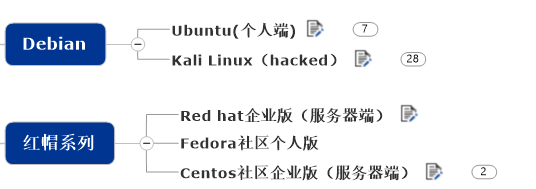

Linux有很多种发行版本，各种发行版本之间安装软件方式和命令不一样，同一个版本之间安装软件也有不同的方法。但是，大体来说，Linux有两大派系，一个是红帽派系，包含Redhat、Centos、Fedora等。还有一个是Debian派系，包含Kali、Ubuntu等。



# 红帽派
## 源码包安装

### 源码包安装步骤

1. 下载源代码安装包文件
2. tar报解压缩：解压并释放源代码包到指定的目录
3. `./configure`配置：设置安装目录、安装模块等选项
4. `make`编译：生成可执行的二进制文件Makefile
5. `make install`安装：复制二进制文件到系统、配置应用环境
6. 配置并使用软件

### 源码安装需要安装编译工具

` yum -y install gcc gcc-c++ make`

### 步骤详解

- `./configure`是用来检测你的安装平台的目标特征的。比如它会检测你是不是有CC或GCC，并不是需要CC或GCC，它是个shell脚本，一般用来生成`Makefile`
- `make`是用来编译的，它从`Makefile`中读取指令，然后编译
- `make install`是用来安装的，它也从`Makefile`中读取指令，安装到指定的位置

#### configure

这一步一般用来生成 Makefile，为下一步的编译做准备，你可以通过在 configure 后加上参数来对安装进行控制，比如代码:  ./configure --prefix=/usr 上面的意思是将该软件安装在 /usr 下面，执行文件就会安装在 /usr/bin.同时一些软件的配置文件你可以通过指定 --sys-config= 参数进行设定。有一些软件还可以加上 --with、--enable、--without、--disable 等等参数对编译加以控制，你可以通过允许 ./configure --help 察看详细的说明帮助。

#### make

这一步就是编译，大多数的源代码包都经过这一步进行编译（当然有些perl或Python编写的软件需要调用perl或python来进行编译）。如果 在 make 过程中出现 error ，你就要记下错误代码（注意不仅仅是最后一行），然后你可以向开发者提交 bugreport（一般在 INSTALL 里有提交地址），或者你的系统少了一些依赖库等，这些需要自己仔细研究错误代码。make 的作用是开始进行源代码编译，以及一些功能的提供，这些功能由他的 Makefile 设置文件提供相关的功能，
make 是 Linux 开发套件里面自动化编译的一个控制程序，他通过借助 Makefile 里面编写的编译规范进行自动化的调用 gcc 、ld 以及运行某些需要的程序进行编译的程序。一般情况下，他所使用的 Makefile 控制代码，由 configure 这个设置脚本根据给定的参数和系统环境生成。

#### make install

这条命令来进行安装（当然有些软件需要先运行 make check 或 make test来进行一些测试），这一步一般需要你有 root 权限（因为要向系统写入文件）。 `make install` 一般表示进行安装，`make uninstall` 是卸载。

## rpm包安装
`RPM (RedHat Package Manager) `：由红帽公司提出，建议统一的数据库文件，详细记录软件包的安装、卸载等变化信息，能够自动分析软件包依赖关系

RPM包的命名格式： firefox-17.0.10-1.el6.centos.x86_64.rpm
                                软件名称 版本号发行次数 硬件平台扩展名

rpm指令管理
  针对已安装软件

    rpm -qa：查询所有已安装软件的rpm包信息，列出包的版本
    rpm  -q httpd： 查看 httpd 是否安装
    rpm -qi  httpd：列出 httpd 软件的详细信息
    rpm -qc httpd：查看 httpd 的配置文件目录
    rpm  -ql  httpd：查看 httpd 所包含的文件
    whereis  httpd：查看httpd的安装路径和可执行文件路径
    根据指令搜索包的名称
    
     which vim：搜索指令在系统中的路径
    rpm -qf   指令的绝对路径 ： 查看该命令是由哪个rpm包所提供  rqm -qf  /usr/bin/vim
  针对未安装软件(需要把光盘文件挂载，然后进入其Package目录下  

    rpm -qpl 包.rpm  选项p表示package，后面需要写包的完整路径信息，qpl表示列出这个包在安装之后生成哪些文件和目录
    rpm -qpi 包.rpm  查询未安装包的详细信息
验证软件：

```
V：后面接软件名称，该软件所含的文件被改动过，才会被列出来。针对一个软件查询。 
Va：列出系统上面所有有可能被改动过的文件。针对真个系统的。 
Vp：后面接RPM软件包。 
Vf：列出某个文件是否被改动过。
```


对于输出中每个标记的含义介绍如下：

```
S 表示文件长度发生了变化
M 表示文件的访问权限或文件类型发生了变化
5 表示MD5校验和发生了变化
D 表示设备节点的属性发生了变化
L 表示文件的符号链接发生了变化
U 表示文件/子目录/设备节点的owner发生了变化
G 表示文件/子目录/设备节点的group发生了变化
T 表示文件最后一次的修改时间发生了变化
```


如果在输出结果中有“M”标记出现，那么对应的文件可能已经遭到篡改或替换，此时可以通过卸载这个rpm包重新安装来清除受攻击的文件。

不过这个命令有个局限性，那就是只能检查通过rpm包方式安装的所有文件，对于通过非rpm包方式安装的文件就无能为力了。同时，如果rpm工具也遭到替换，就不能通过这个方法了，此时可以从正常的系统上复制一个rpm工具进行检测。

对文件系统的检查也可以通过chkrootkit、RKHunter这两个工具来完成。

  安装与卸载

    rpm  -ivh  包.rpm        i表示安装，v表示显示安装过程，h表示以‘#’作为进度，显示安装进度
    rpm  -e  包的名称         移除指定的rpm包
## yum源安装
`YUM(Yellow dog  Updater Modified)`: **基于RPM包**构建的软件更新机制，可以自动解决rpm包之间的依赖关系，所有软件包由集中的yum软件仓库提供

相关文章：[Redhat7配置yum源(本地源和网络源)](https://blog.csdn.net/qq_36119192/article/details/82222175)
一些常见的yum命令：

```
yum  clean all                           清空缓存信息
yum  list                                   列出所有包的信息
yum  list  httpd                         查看 httpd 是否安装
yum  info httpd                        显示 httpd 包的详细具体信息
yum install httpd   -y               安装 httpd 包
yum remove httpd  -y               卸载 httpd 包
yum search 关键词                 根据关键词，在已发现的repo源中搜索包含关键词的rpm包
yum provides 命令                   根据命令，在已发现的repo源中搜索安装指令的rpm包
yum history  list/info/undo/redo number             history可以列出，查看，重装，反安装对应的包，但是是以yum指令的操作顺序为依据的，所以需要加指定的数字执行
yum update -y                        升级所有包同时也升级软件和系统内核
yum upgrade  -y                     只升级所有包，不升级软件和系统内核
```

# Debian派

## Deb包安装

DEB是Debian软件包格式的文件扩展名，Debian包是Unixar的标准归档，将包文件信息以及包内容，经过gzip和tar打包而成。
处理这些包的经典程序是dpkg，经常是通过Debian的apt-get来运作。deb 格式是 Debian 系统(包含 Debian 和 Ubuntu )专属安装包格式，配合 APT 软件管理系统，成为了当前在 Linux 下非常流行的一种安装包

dpkg指令用法：

    -i：安装软件包；
    -r：删除软件包；
    -P：删除软件包的同时删除其配置文件；
    -L：显示于软件包关联的文件；
    -l：显示已安装软件包列表；
    --unpack：解开软件包；
    -c：显示软件包内文件列表；
    --confiugre：配置软件包。
## apt-get源安装

1.Ubuntu中的高级包管理方法apt-get

除了apt的便捷以外，apt-get的一大好处是**极大地减小了所谓依赖关系恶梦的发生几率(dependency hell)**，即使是陷入了dependency hell，apt-get也提供了很好的援助手段，帮你逃出魔窟。 
通常 apt-get 都和网上的压缩包一起出没，从互联网上下载或是安装。全世界有超过200个 debian官方镜像，还有繁多的非官方软件包提供网站。你所使用的基于Debian的发布版不同，你所使用的软件仓库可能需要手工选择或是可以自动设置。你能从Debian官方网站得到完整的镜像列表。而很多非官方网站提供各种特殊用途的非官方软件包，当然，使用非官方软件包会有更多风险了。 
软件包都是为某一个基本的Debian发布版所准备的(从unstable 到stable)，并且划分到不同类别中(如 main contrib nonfree)，这个是依据 debian 自由软件纲领而划分的(也就是常说的dfsg)，因为美国限制加密软件出口，还有一个non-us类别。 

2.常用的APT命令参数

```
apt-cache search package    搜索包 
apt-cache show package      获取包的相关信息，如说明、大小、版本等 
sudo apt-get install httpd      安装软件
sudo apt-get install package -- reinstall  重新安装包 
sudo apt-get -f install      修复安装"-f = --fix-missing" 
sudo apt-get remove httpd    卸载软件
sudo apt-get remove package -- purge  删除包，包括删除配置文件等 
sudo apt-get update   更新源 
sudo apt-get upgrade  更新已安装的包 
sudo apt-get dist-upgrade  升级系统 
sudo apt-get dselect-upgrade  使用 dselect 升级 
apt-cache depends package  了解使用依赖 
apt-cache rdepends package  是查看该包被哪些包依赖 
sudo apt-get build-dep package  安装相关的编译环境 
apt-get source package  下载该包的源代码 
sudo apt-get clean && sudo apt-get autoclean  清理无用的包 
sudo apt-get check  检查是否有损坏的依赖
```

原文链接：https://blog.csdn.net/qq_36119192/article/details/82866329