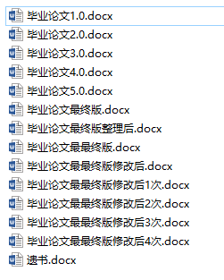

# 版本控制系统简述

## 背景

写毕业论文时是否有过以下感受，改一点东西就备份下，最后你的文件夹如下：

导师让你来来回回改，碰到坑的还有让你改回原版的情况，你想找回被删除的文字，但是已经记不清删除前保存在哪个文件里了，只好一个一个文件去找

一堆文件看着心烦又不敢删怕哪天要用

更要命的是，发给导师改的时候，自己也在改，最后还要自己手动合并，还可能漏

以上所述为手动版本控制的流程，未解决上述头疼的问题，版本控制系统出现了

## 概念和作用

**版本控制系统**能记录所有文件的所有版本，可以有效的追踪文件的变化，同时很容易回滚到之前某个版本的状态。

作用：

- 备份文件：在服务器中保存代码，方便随时恢复
- 记录历史：追溯任意代码文件的任意一行在什么时间被什么人修改过
- 回到过去：让版本库中的任意一个文件恢复到任意一个历史版本
- 多端共享：多个终端都可以共享同一份代码
- 团队协作：方便团队协作开发，尽可能减少冲突代码不一致情况

# 常用术语

## 仓库（Repository）

受版本控制的所有文件修订历史的共享数据库

## 工作空间（Workspace)
本地硬盘或Unix 用户帐户上编辑的文件副本

## 工作树/区（Working tree）
工作区中包含了仓库的工作文件。您可以修改的内容和提交更改作为新的提交到仓库。

## 签入（Checkin）

将新版本复制回仓库

## 签出（Checkout）

从仓库中将文件的最新修订版本复制到工作空间

## 提交（Commit）

对各自文件的工作副本做了更改，并将这些更改提交到仓库

## 冲突（Conflict）

多人对同一文件的工作副本进行更改，并将这些更改提交到仓库

## 合并（Merge）

将某分支上的更改联接到此主干或同为主干的另一个分支

## 分支（Branch）

从主线上分离开的副本，默认分支叫master

## 锁（Lock）

获得修改文件的专有权限。

## 头（HEAD）

头是一个象征性的参考，最常用以指向当前选择的分支。

## 修订（Revision）

表示代码的一个版本状态。Git通过用SHA1 hash算法表示的ID来标识不同的版本。

## 标记（Tags）

标记指的是某个分支某个特定时间点的状态。通过标记，可以很方便的切换到标记时的状态。

# 常见的版本控制器

主流的版本控制器有如下这些：

- **Git**
- **SVN**（Subversion）
- **CVS**（Concurrent Versions System）
- **VSS**（Micorosoft Visual SourceSafe）
- **TFS**（Team Foundation Server）
- Visual Studio Online

版本控制产品非常的多（Perforce、Rational ClearCase、RCS（GNU Revision Control System）、Serena Dimention、SVK、BitKeeper、Monotone、Bazaar、Mercurial、SourceGear Vault），现在影响力最大且使用最广泛的是Git与SVN

## CVS

`CVS（Concurrent Versions System）`版本控制系统是一种GNU软件包，主要用于在多人开发环境下的源码的维护。
 `CVS`用`Copy-Modify-Merge`(拷贝、修改、合并)变化表支持对文件的同时访问和修改。
 `CVS`基于客户端/服务器的行为使其可容纳多个用户。
 `CVS`作为最早的开源而且免费的集中式版本控制系统，直到现在还有不少人在用。

## SVN

由于`CVS`自身设计的问题，会造成提交文件不完整，版本库莫名其妙损坏的情况。
 同样是开源而且免费的`SVN`修正了`CVS`的一-些稳定性问题，是目前用得最多的集中式版本库控制系统。

## GIT

`GIT（The stupid content tracker）`傻瓜内容跟踪器。`Linus Torvalds`这样介绍。是一款免费、开源的分布式版本控制系统，用于敏捷高效地处理任何或小或大的项目。
 分布式相比于集中式的最大区别在于开发者可以提交到本地，每个开发者机器上都是一个完整的数据库。

## 工具对比

| 特性     | CVS        | SVN      | GIT      |
| -------- | ---------- | -------- | -------- |
| 并发修改 | 支持       | 支持     | 支持     |
| 并发提交 | 不支持     | 支持     | 支持     |
| 历史轨迹 | 不支持更名 | 支持更名 | 支持更名 |
| 分布式   | 不支持     | 不支持   | 支持     |

# 版本控制分类

## 本地版本控制

记录文件每次的更新，可以对每个版本做一个快照，或是记录补丁文件，适合个人用，如RCS。

## 集中版本控制

所有的版本数据都保存在服务器上，协同开发者从服务器上同步更新或上传自己的修改

所有的版本数据都存在服务器上，用户的本地只有自己以前所同步的版本，如果不连网的话，用户就看不到历史版本，也无法切换版本验证问题，或在不同分支工作。而且，所有数据都保存在单一的服务器上，有很大的风险这个服务器会损坏，这样就会丢失所有的数据，当然可以定期备份。代表产品：SVN、CVS、VSS

## 分布式版本控制

所有版本信息仓库全部同步到本地的每个用户，这样就可以在本地查看所有版本历史，可以离线在本地提交，只需在连网时push到相应的服务器或其他用户那里。由于每个用户那里保存的都是所有的版本数据，只要有一个用户的设备没有问题就可以恢复所有的数据，但这增加了本地存储空间的占用。

## 集中式vs分布式

整理自：

https://www.jianshu.com/p/35a73169ac4a

https://www.cnblogs.com/syp172654682/p/7689328.html