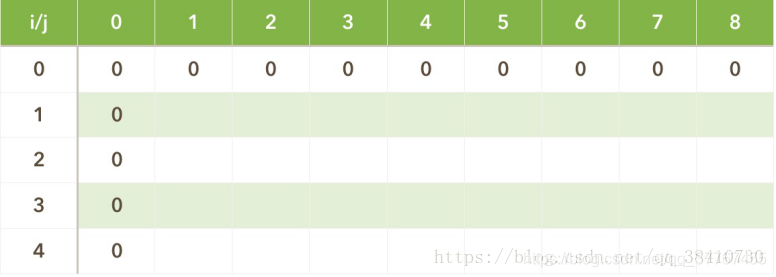
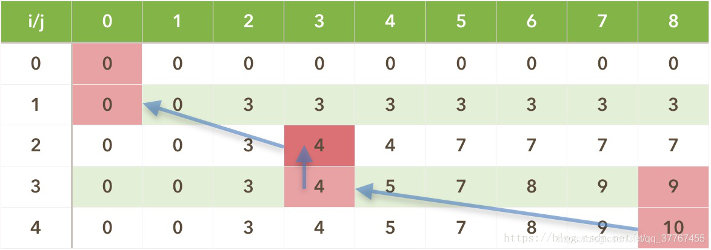

# 0/1背包

## 问题描述

**有n个不同物品，它们有各自的体积和价值，现有给定容量的背包，如何让背包里装入的物品具有最大的价值总和？**

为方便讲解和理解，下面讲述的例子均先用具体的数字代入，即：eg：number＝4，capacity＝8


| i(物品编号) | 1    | 2    | 3    | 4    |
| ----------- | ---- | ---- | ---- | ---- |
| w(体积)     | 2    | 3    | 4    | 5    |
| v(价值)     | 3    | 4    | 5    | 6    |


## 解题思路

根据动态规划解题步骤（问题抽象化、建立模型、寻找约束条件、判断是否满足最优性原理、找大问题与小问题的递推关系式、填表、寻找解组成）找出01背包问题的最优解以及解组成，然后编写代码实现。

在解决问题之前，为描述方便，首先定义一些变量：**Vi表示第 i 个物品的价值，Wi表示第 i 个物品的体积，定义V(i,j)：当前背包容量 j，前 i 个物品最佳组合对应的价值**，同时背包问题抽象化（X1，X2，…，Xn，其中 Xi 取0或1，表示第 i 个物品选或不选）。

*1、建立模型，即求max(V1X1+V2X2+…+VnXn)；*

*2、寻找约束条件，W1X1+W2X2+…+WnXn<capacity；*

*3、寻找递推关系式，面对当前商品有两种可能性：*

- **包的容量比该商品体积小，装不下，此时的价值与前i-1个的价值是一样的，即V(i,j)=V(i-1,j)；**
- **还有足够的容量可以装该商品，但装了也不一定达到当前最优价值，所以在装与不装之间选择最优的一个，即V(i,j)=max｛V(i-1,j)，V(i-1,j-w(i))+v(i)｝。**

------

其中V(i-1,j)表示不装，V(i-1,j-w(i))+v(i) 表示装了第i个商品，背包容量减少w(i)，但价值增加了v(i)；

由此可以得出递推关系式：

- j<w(i) V(i,j)=V(i-1,j)
- j>=w(i) V(i,j)=max｛V(i-1,j)，V(i-1,j-w(i))+v(i)｝

------

这里需要解释一下，为什么能装的情况下，需要这样求解（这才是本问题的关键所在！）：

可以这么理解，**如果要到达V(i,j)这一个状态有几种方式**？

**肯定是两种，第一种是第i件商品没有装进去，第二种是第i件商品装进去了**。没有装进去很好理解，就是V(i-1,j)；装进去了怎么理解呢？如果装进去第i件商品，那么装入之前是什么状态，肯定是V(i-1,j-w(i))。由于最优性原理（上文讲到），V(i-1,j-w(i))就是前面决策造成的一种状态，后面的决策就要构成最优策略。两种情况进行比较，得出最优。

4、填表，首先初始化边界条件，V(0,j)=V(i,0)=0；



然后一行一行的填表：

- 如，i=1，j=1，w(1)=2，v(1)=3，有j<w(1)，故V(1,1)=V(1-1,1)=0；
- 又如i=1，j=2，w(1)=2，v(1)=3，有j=w(1),故V(1,2)=max｛
  V(1-1,2)，V(1-1,2-w(1))+v(1) ｝=max｛0，0+3｝=3；
- 如此下去，填到最后一个，i=4，j=8，w(4)=5，v(4)=6，有j>w(4)，故V(4,8)=max｛
  V(4-1,8)，V(4-1,8-w(4))+v(4) ｝=max｛9，4+6｝=10……

------

所以填完表如下图：


5、表格填完，最优解即是V(number,capacity)=V(4,8)=10。

## 代码实现

为了和之前的动态规划图可以进行对比，尽管只有4个商品，但是我们创建的数组元素由5个。

```c++
#include<iostream>
using namespace std;
#include <algorithm>
 
int main()
{
	int w[5] = { 0 , 2 , 3 , 4 , 5 };			//商品的体积2、3、4、5
	int v[5] = { 0 , 3 , 4 , 5 , 6 };			//商品的价值3、4、5、6
	int bagV = 8;					        //背包大小
	int dp[5][9] = { { 0 } };			        //动态规划表
 
	for (int i = 1; i <= 4; i++) {
		for (int j = 1; j <= bagV; j++) {
			if (j < w[i])
				dp[i][j] = dp[i - 1][j];
			else
				dp[i][j] = max(dp[i - 1][j], dp[i - 1][j - w[i]] + v[i]);
		}
	}
 
	//动态规划表的输出
	for (int i = 0; i < 5; i++) {
		for (int j = 0; j < 9; j++) {
			cout << dp[i][j] << ' ';
		}
		cout << endl;
	}
 
	return 0;
}
123456789101112131415161718192021222324252627282930
```

## 最优解回溯

通过上面的方法可以求出背包问题的最优解，但还不知道这个最优解由哪些商品组成，故要根据最优解回溯找出解的组成，根据填表的原理可以有如下的寻解方式：

- V(i,j)=V(i-1,j)时，说明没有选择第i 个商品，则回到V(i-1,j)；
- V(i,j)=V(i-1,j-w(i))+v(i)时，说明装了第i个商品，该商品是最优解组成的一部分，随后我们得回到装该商品之前，即回到V(i-1,j-w(i))；
- 一直遍历到i＝0结束为止，所有解的组成都会找到。

------

就拿上面的例子来说吧：

- 最优解为V(4,8)=10，而V(4,8)!=V(3,8)却有V(4,8)=V(3,8-w(4))+v(4)=V(3,3)+6=4+6=10，所以第4件商品被选中，并且回到V(3,8-w(4))=V(3,3)；
- 有V(3,3)=V(2,3)=4，所以第3件商品没被选择，回到V(2,3)；
- 而V(2,3)!=V(1,3)却有V(2,3)=V(1,3-w(2))+v(2)=V(1,0)+4=0+4=4，所以第2件商品被选中，并且回到V(1,3-w(2))=V(1,0)；
- 有V(1,0)=V(0,0)=0，所以第1件商品没被选择。

------



# 完全背包问题

## 问题描述

**有n种物品，每种物品都有无限个，它们有各自的体积和价值，现有给定容量的背包，如何让背包里装入的物品具有最大的价值总和？**

为方便讲解和理解，下面讲述的例子均先用具体的数字代入，即：eg：number＝4，capacity = 12

| i(物品编号) | 1    | 2    | 3    | 4    |
| ----------- | ---- | ---- | ---- | ---- |
| w(体积)     | 2    | 3    | 4    | 5    |
| v(价值)     | 1    | 2    | 2    | 4    |


## 解题思路

根据动态规划解题步骤（问题抽象化、建立模型、寻找约束条件、判断是否满足最优性原理、找大问题与小问题的递推关系式、填表、寻找解组成）找出01背包问题的最优解以及解组成，然后编写代码实现。

在解决问题之前，为描述方便，首先定义一些变量：**Vi表示第 i 个物品的价值，Wi表示第 i 个物品的体积，定义V(i,j)：当前背包容量 j，前 i 个物品最佳组合对应的价值**，同时背包问题抽象化（k1，k2，…，kn，其中 ki 取任意整数，表示第 i 个物品选选几件）。

1、建立模型，即求max(k1V1X1+k2V2X2+…+knVnXn)；

2、寻找约束条件，k1W+k2W2+…+knWn<=capacity；

3、寻找递推关系式，面对当前商品有需要选择的是：