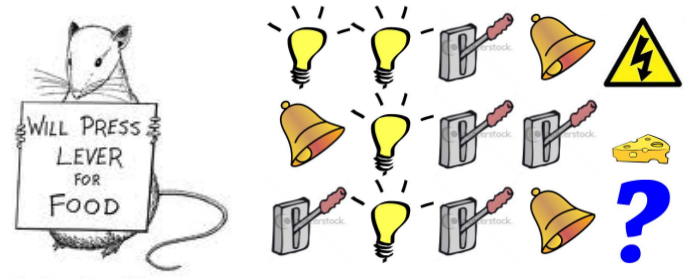

强化学习问题可以从智能体和环境两方面来描述。

在 $t$ 时刻，智能体和环境分别可以：

| 智能体                                                       | 环境                                                         |
| ------------------------------------------------------------ | ------------------------------------------------------------ |
| 有一个对于环境的观察评估$O_t$ 做出一个行为$A_t$  从环境得到一个奖励信号 $R_{t+1}$ |  接收个体的动作 $A_t$，更新环境信息 给个体一个奖励信号 $R_{t+1}$  同时使得个体可以得到下一个观测$O_{t+1}$  |

# 序列决策问题 Sequential Decision Making

强化学习解决的是序列决策问题，即环境状态->行动->新的环境状态->下一步行动的决策

决策的目标：选择一定的行为系列以**最大化未来的总体奖励**，这些行为可能是一个长期的序列，奖励可能而且通常是延迟的，有时候宁愿牺牲即时（短期）的奖励以获取更多的长期奖励

比如：下棋时，没有到最后一刻都不知道棋局结果，而要决策的是一系列下棋的位置

# 一些概念

## 环境 Environment

### 奖励 Reward

$R_t$ 是信号的反馈，是一个标量，它反映智能体在 $t$ 时刻做得怎么样。个体的工作就是最大化累计奖励。
比如：Flappy bird可把奖励定义为当前做完该行动的得分

> 强化学习主要基于这样的”奖励假设”：所有问题解决的目标都可以被描述成最大化累积奖励。

## 环境与智能体交互

### 历史 History

历史是观测、行为、奖励的序列： $H_{t}=O_{1}, A_{1}, R_{1}, \ldots, O_{t-1}, A_{t-1}, R_{t-1}, O_{t}, A_{t}, R_{t}$

### 状态 State（重要）

状态是所有决定将来行为的已有的信息，是对历史信息的总结，通常我们研究的是State而不是HIstory， 是关于历史的一个函数 $S_{t}=f\left(H_{t}\right)$

状态只有经过最后一次观测才能是合理有效的

状态的三种定义：

1. 环境状态

  是环境的私有呈现，真实环境抽象的某些数字集合，理解真实环境。包括环境用来决定下一个观测/奖励的所有数据，通常对个体并不完全可见，也就是个体有时候并不知道环境状态的所有细节。即使有时候环境状态 $S_{t}^{e}$ 对个体可以是完全可见的，这些信息也可能包含着一些无关信息。

2. 智能体状态

  是智能体的内部呈现，包括智能体可以使用的、决定未来动作的所有信息。智能体状态是强化学习算法可以利用的信息，它可以是历史的一个函数：$S_{t}^{a}=f\left(H_{t}\right)$

3. 信息状态（用数学语言对状态进行定义）

  包括历史上所有**有用**的信息，又称Markov状态

  在我们使用状态表示法的时候，这些状态包含history的全部有用信息，我们能做的就是定义一个状态表示，使状态具有马尔可夫性

> 马尔可夫性
>
> 指系统的下一个状态$s_{t+1}$仅与当前状态$s_t$有关，与过去没多大关系）。$状态s_t是马尔科夫的\Leftrightarrow P[s_{t+1} | s_t]=P[s_{t+1}|s_1,...,s2]$
>
> 即$H_{1:t}$

也就是说，如果信息状态是可知的，那么所有历史信息都可以丢掉，仅需要$t$时刻的信息状态就可以了。例如：环境状态是Markov的，因为环境状态是环境包含了环境决定下一个观测/奖励的所有信息；同样，（完整的）历史$H_t$也是马尔可夫的，即
$$
H_t \to S_t \to H_{t+1: \infty}
$$

例：

有如下三个针对老鼠的事件序列，其中前两个最后的事件分别是老鼠遭电击和获得一块奶酪，现在请分析比较这三个事件序列的特点，分析第第三个事件序列中，老鼠是获得电击还是奶酪？

- 假如个体状态 = 序列中的后三个事件（不包括电击、获得奶酪，下同），事件序列3的结果会是什么？（电击）
- 假如个体状态 = 亮灯、响铃和拉电闸各自事件发生的次数，那么事件序列3的结果又是什么？（奶酪）
- 假如个体状态 = 完整的事件序列，那结果又是什么？（未知）

状态表示某种程度上决定了未来会发生什么。我们可以使用各种各样不同的方式来表征我们的状态

- **完全可观测的环境 Fully Observable Environments**

智能体能够直接观测到环境状态。在这种条件下:
$$
智能体对环境的观测O_t = 个体状态S_t^a = 环境状态S_t^e
$$
这种问题是一个**马尔可夫决策过程**（Markov Decision Process， MDP）

- **部分可观测的环境 Partially Observable Environments**

智能体间接观测环境。几个例子：

1. 一个可拍照的机器人个体对于其周围环境的观测并不能说明其绝度位置，它必须自己去估计自己的绝对位置，而绝对位置则是非常重要的环境状态特征之一；
2. 一个交易员只能看到当前的交易价格；
3. 一个扑克牌玩家只能看到自己的牌和其他已经出过的牌，而不知道整个环境（包括对手的牌）状态。

在这种条件下： 
$$
智能体状态 ≠ 环境状态
$$
这种问题是一个**部分可观测马儿可夫决策过程**。智能体必须构建它自己的状态呈现形式。

比如：记住完整的历史，整个动作序列是一个状态：$S_t^a = H_t$ 。这种方法比较原始、幼稚。

还有其他办法，例如 ：

1. Beliefs of environment state：此时虽然智能体不知道环境状态到底是什么样，但智能体可以利用已有经验（数据），用各种个体已知状态的概率分布作为当前时刻的智能体状态的呈现：
   $$
   S_{t}^{a}=\left(\mathbb{P}\left[S_{t}^{e}=s^{1}\right], \ldots, \mathbb{P}\left[S_{t}^{e}=s^{n}\right]\right)
   $$

2. Recurrent neural network：不需要知道概率，只需要将最近的智能体状态与最近的观测结合起来，送入循环神经网络(RNN)中得到一个当前智能体状态的呈现：

$$
S_{t}^{a}=\sigma\left(S_{t-1}^{a} W_{s}+O_{t} W_{o}\right)
$$

## 智能体 Agent

智能体可以由以下三个组成部分中的一个或多个组成：

### 策略 Policy

策略是决定智能体行为的机制。是从状态到行为的一个映射，可以是确定性的$a = \pi(s)$，也可以是不确定性的$\pi(a|s)=P[A=a|S=s]$。

比如：在看电视这个状态，做作业的概率是0.3，出去玩的概率是0.7。就是一个策略

### 价值函数 Value Function

是一个未来奖励的预测，用来评价当前状态的好坏程度。当面对两个不同的状态时，智能体可以用一个Value值来评估这两个状态可能获得的最终奖励区别，继而指导选择不同的行为，即制定不同的策略。同时，一个价值函数是基于某一个特定策略的，不同的策略下同一状态的价值并不相同。

### 模型 Model

智能体对环境的一个建模，它体现了个体是如何思考环境运行机制的（如何理解环境，模拟环境），个体希望模型能模拟环境与个体的交互机制。

模型至少要解决两个问题：

一是状态转化概率，即预测下一个可能状态发生的概率
$$
\mathcal{P}_{s s^{\prime}}^{a}=\mathbb{P}\left[S_{t+1}=s^{\prime} | S_{t}=s, A_{t}=a\right]
$$
即状态是$s$且执行了$a$操作的条件下下一个状态是$s^{\prime}$的概率

另一项工作是预测可能获得的即时奖励
$$
\mathcal{R}_{s}^{a}=\mathbb{E}\left[R_{t+1} | S_{t}=s, A_{t}=a\right]
$$
即到目前为止，出现了状态是$s$后执行了$a$操作的情况，所获得的平均奖励
> 注意： 
> 1. 模型并不是构建一个个体所必需的，很多强化学习算法中个体并不依赖模型。
> 2. 模型仅针对个体而言，环境实际运行机制不称为模型，而称为环境动力学(dynamics of environment)，它能够明确确定个体下一个状态和所得的即时奖励。

例：
在 Flappy bird 这个游戏中，需要简单的点击操作来控制小鸟，躲过各种水管，飞的越远越好，因为飞的越远就能获得更高的积分奖励。

这就是一个典型的强化学习场景：
- 小鸟角色——智能体
- 水管排布——环境
- 控制小鸟飞的更远——决策目标
- $t$时刻水管的排布——环境的观察评估$O_t$
- $t$小鸟飞——行动$A_t$
- $t$时刻是否撞柱子——奖励信号 $R_t$

> 根据智能体的三个组成部分分类
>
> 是否有策略/价值函数
> - Value Based
>   没有策略，靠价值函数选择，存储的是价值函数
> - policay Based
>   没有价值函数，靠策略选择，存储的是策略
> - Actor Critic
>   前面两者的结合，既有策略，也有价值函数
>
> 是否有模型
> - Model Free：没有模型，有策略或/和价值函数
> - Model Based：有模型，有策略或/和价值函数

## 学习和规划 Learning & Planning

- 学习：环境初始时是未知的，个体不知道环境如何工作，个体通过与环境进行交互，逐渐改善其行为策略。
- 规划: 环境如何工作对于个体是已知或近似已知的，个体并不与环境发生实际的交互，而是利用其构建的模型进行计算，在此基础上改善其行为策略。

一个常用的强化学习问题解决思路是，先学习环境如何工作，也就是了解环境工作的方式，即学习得到一个模型，然后利用这个模型进行规划。

## 探索和利用 Exploration & Exploitation

强化学习类似于一个试错的学习，个体需要从其与环境的交互中发现一个好的策略，同时又不至于在试错的过程中丢失太多的奖励。探索和利用是个体进行决策时需要平衡的两个方面。

一个形象的比方是，当你去一个餐馆吃饭，“探索”意味着你对尝试新餐厅感兴趣，很可能会去一家以前没有去过的新餐厅体验，“利用”则意味着你就在以往吃过的餐厅中挑一家比较喜欢的，而不去尝试以前没去过的餐厅。这两种做法通常是一对矛盾，但对解决强化学习问题又都非常重要。

其它一些例子，在线广告推广时，显示最受欢迎的广告和显示一个新的广告；油气开采时选择一个已知的最好的地点同在未知地点进行开采；玩游戏时选择一个你认为最好的方法同实验性的采取一个新的方法。

## 预测和控制 Prediction & Control

在强化学习里，我们经常需要先解决关于预测（prediction）的问题，而后在此基础上解决关于控制（Control）的问题。

- 预测：给定一个策略，评价未来。可以看成是求解在给定策略下的价值函数（value function）的过程。How well will I(an agent) do if I(the agent) follow a specific policy?
- 控制：找到一个好的策略来最大化未来的奖励。

举了一个例子来说明预测和控制的区别。

预测：现在给出了从A到A’的奖励以及从B到B’的奖励，在“随机选择4个方向进行移动”的策略下，如何得知每一个位置的价值。

控制：同样的条件，在所有可能的策略下最优的价值函数是什么？最优策略是什么？

# 总结

强化学习解决的序列决策问题，智能体可由三个部分组成：策略、价值函数、模型。环境会响应智能体的行为，给予奖励。智能体和环境的交互过程中会产生由【观察，行为，奖励】构成的序列称为历史，智能体将历史概括为状态。当环境完全可观测时，观察值=个体状态=环境状态，为一个马尔可夫决策过程；当环境部分可观测时，观察值≠环境状态，需要构建自己状态的呈现方式（通过RNN等方式构建），为部分可观测马尔可夫决策过程

