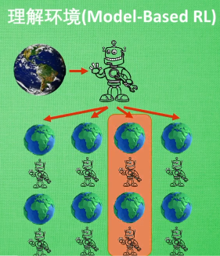
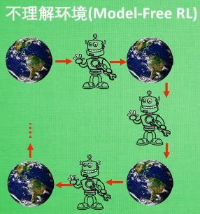
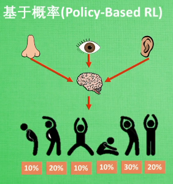
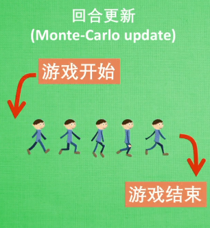
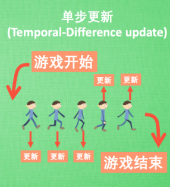
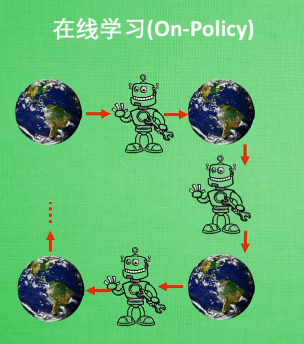

# 强化学习是什么

强化学习(Reinforcement Learning, RL)是机器学习的一个重要分支：监督学习、无监督学习、强化学习，又称为增强学习，模拟的是人类的一种学习方式，在执行某个动作或决策后根据执行效果来获得奖励，通过不断与环境的交互进行学习，最终达到目标。即强调如何基于环境而行动，以取得最大化的预期利益。

其灵感来源于心理学中的行为主义理论，即有机体如何在环境给予的奖励或惩罚的刺激下，逐步形成对刺激的预期，产生能获得最大利益的习惯性行为。

主要包含四个元素，**智能体（agent），状态，行动，奖励**， 强化学习的目标就是获得最多的累计奖励 

> 强化学习与监督学习、无监督学习的区别
>
> 强化学习不同于 *监督学习*。 监督学习是目前机器学习领域中研究最多的一种学习方式，它从知识渊博的教练所提供的有标记的训练集中学习。 每一个样例都是一种情况的描述，都带有标签，标签描述的是系统在该情况下的应该采取的正确动作，每一个样例用来识别这种情况应该属于哪一类。 这种学习的目的是让系统推断概括它应有的反馈机制，使它可以对未知样本作出正确回应。 这是一种重要的学习方式，但单凭它并不足以从交互中学习。 在交互问题中，找到期待的既正确又典型的样例通常都是不切实际的。 在一个未知的领域，若要使收益最大化，个体必须能够从自己的经验中学习。
>
> 强化学习也与机器学习研究人员所谓的 *无监督学习* 不同，后者通常是用于寻找隐藏在未标记数据集合中的结构。 监督学习和无监督学习这两个术语似乎对机器学习范式进行了详尽的分类，但事实却并非如此。 尽管人们可能会试图将强化学习视为一种无监督学习，因为它不依赖于正确行为的样例，但强化学习试图最大化奖励信号而不是试图找到隐藏的结构。 在个体的经验数据中揭示结构确实对强化学习特别有用，但是它本身并没有解决最大化奖励信号的强化学习问题。 因此，我们认为强化学习是除监督学习和无监督学习之外的第三种机器学习范式，也许还有其他范式。

# 强化学习的特点

强化学习是一种学习如何将状态映射到动作，以获得最大奖励的学习机制。 学习者不会被告知要采取哪些动作，而是必须通过尝试来发现哪些动作会产生最大的回报。 动作不仅可以影响直接奖励，还可以影响下一个状态，并通过下一个状态，影响到随后而来的奖励。 这两个特征 - **试错法和延迟奖励** - 是强化学习的两个最重要的可区别特征。 

1. 没有监督数据、只有奖励信号
2. 奖励信号不一定是实时的，而很可能是延后的，有时甚至延后很多。
3. 时间（序列）是一个重要因素
4. 当前的行为影响后续接收到的数据

# 发展历程：

- 1956年 Bellman提出了动态规划方法。
- 1977年 Werbos提出只适应动态规划算法。
- 1988年 sutton提出时间差分算法。
- 1992年 Watkins 提出Q-learning 算法。
- 1994年 rummery 提出Saras算法。
- 1996年 Bersekas提出解决随机过程中优化控制的神经动态规划方法。
- 2006年 Kocsis提出了置信上限树算法。
- 2009年 kewis提出反馈控制只适应动态规划算法。
- 2014年 silver提出确定性策略梯度（Policy Gradients）算法。
- 2015年 Google-deepmind 提出Deep-Q-Network算法。

# 强化学习的应用

直升机特技飞行、经典游戏、投资管理、发电站控制、让机器人模仿人类行走等

# 强化学习解决什么问题

强化学习试图解决决策优化的问题。即面对特定状态（State,S），采取什么行动方案（Action,A）， 通过选择一定的行动系列，使得未来的总体奖励最大（Reward,R）。比如：下棋、投资、课程安排、驾车

例：在 Flappy bird 这个游戏中，我们需要简单的点击操作来控制小鸟，躲过各种水管，飞的越远越好，因为飞的越远就能获得更高的积分奖励。面对特定的水管排布选择“飞”这个动作，通过选择一系列动作（如：飞|不飞|飞|飞）来使小鸟飞得更远获得更多的分

> 强化学习的本质是在大空间中寻找最优解，是介于穷举和贪婪之间的一种探索机制，这种探索机制是学习得来的。
> “介于穷举和贪婪之间”：不用穷举可以减少搜索量，提升速度；不用贪婪可以尽量避免局部最优解。因此可以说是在计算时间与全局最优之间的权衡。

# 强化学习算法分类

## 强化学习的几个元素的角度划分

- Policy based, 关注点是找到最优策略
- Value based, 关注点是找到最优奖励总和
- Action based, 关注点是每一步的最优行动

## 其他角度划分
1. 基于理不理解所处环境来进行分类：

- **Model-free**：环境给了我们什么就是什么. 我们就把这种方法叫做 model-free, 这里的 model 就是用模型来表示环境

- **Model-based**：那理解了环境也就是学会了用一个模型来代表环境, 所以这种就是 model-based 方法

  
  
  

2. 基于是否直接输出各个动作概率进行分类：

- **Policy based**：通过感官分析所处的环境, 直接输出下一步要采取的各种动作的概率, 然后根据概率采取行动。

- **Value based**：输出的是所有动作的价值, 根据最高价值来选动作，这类方法不能选取连续的动作。

  

3. 是否单步更新分类：

- **Monte-carlo update**：游戏开始后, 要等待游戏结束, 然后再总结这一回合中的所有转折点, 再更新行为准则。

- **Temporal-difference update**：在游戏进行中每一步都在更新, 不用等待游戏的结束, 这样就能边玩边学习了。

   
   
   基于是否在线学习分类：

- **On-policy**：必须本人在场, 并且一定是本人边玩边学习。

- **Off-policy**：可以选择自己玩, 也可以选择看着别人玩, 通过看别人玩来学习别人的行为准则。

  

# 代表性算法

## Q-learning

Q-learning定义动作效用函数（action-utility function），用于判断在特定状态下采取某个动作的优劣，可以将之理解为智能体（Agent）的大脑。

Q-learning 只利用了下一步信息, 让系统按照策略指引进行探索，在探索每一步都使用更新公式进行状态价值的更新

## Sarsa

同Q-learning只是更新公式不同

## DQN

DQN（Deep Q Network）是一种融合了神经网络和Q learning的方法.

有些问题太复杂，Q表无法存储，即使可以存储，搜索也很麻烦。故而，将Q表用神经网络进行替代。

## Policy Gradients

## Actor-critic

 算法分为两个部分：Actor 和 Critic。Actor 更新概率， Critic 更新价值。Critic 就可以用之前介绍的 SARSA 或者 Q Learning 算法。 是基于价值和基于概率的结合体

# 如何用强化算法解决问题

1. 将实际问题建模成马尔可夫决策过程，抽象出五元组（状态集、动作集、状态转移概率、奖励函数、折扣因子），  其中奖励与实际目标相关联

2. 根据动作是否连续选择对应的算法 

  ​    动作离散：DQN   

  ​    动作连续：Policy Gradients，Actor-Critic，DDPG

3. 根据算法写代码

# 强化学习资料

强化学习课程

> 【推荐】David Silver 的 UCL 强化学习课程：http://www0.cs.ucl.ac.uk/staff/d.silver/web/Teaching.html
> DeepMind 和 UCL 的深度学习和强化学习课程：https://www.youtube.com/playlist?list=PLqYmG7hTraZDNJre23vqCGIVpfZ_K2RZs
> Sergey Levine 教授的深度强化学习课程：http://rail.eecs.berkeley.edu/deeprlcourse/
> OpenAI 的 Spinning Up in Deep RL：https://blog.openai.com/spinning-up-in-deep-rl/

书籍

> Sutton 和 Barto 的强化学习著作《Reinforcement learning: an introduction》：http://incompleteideas.net/book/the-book-2nd.html
> 一本有关深度强化学习的书籍草稿：https://arxiv.org/abs/1810.06339
> Richard Sutton 和 Andrew Barto的《强化学习：简介（第二版）》：http://incompleteideas.net/book/RLbook2018.pdf 
>  郭宪博士2017年写的《深入浅出强化学习：原理入门》，入门级别的书，语言通俗易懂

学习路线

 https://github.com/dennybritz/reinforcement-learning
